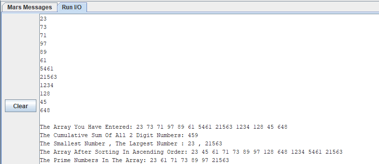

# MIPS-Arrays-repo

<pre>
Using MARS Program & MIPS LANGUAGE(RISC) this is a program that reads 12 integer numbers greater than zero,
and any number less than or equal to zero entered by the user must be ignored.
  These numbers will be stored in an array. then it will do the following things:
    • Print the cumulative sum of all 2 digit numbers.
    • Print on the screen the smallest number and the largest number.
    • Print the numbers on the screen ordered in ascending order.
    • Print on the screen the numbers that are considered prime.
</pre>

